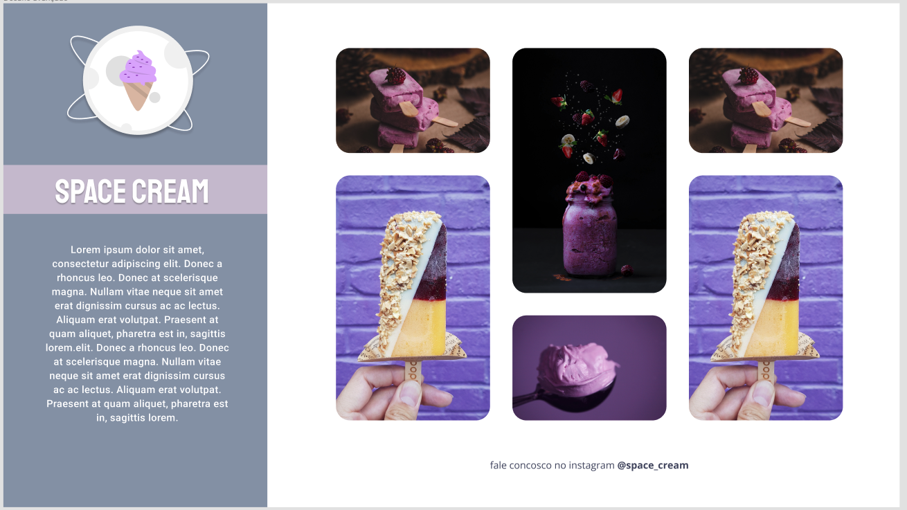

# Space Cream

This project aims to demonstrate skills in HTML and CSS, creating a web page with a nice and intuitive layout and css animations.

The project is part of the course Explorer Rocketseat



## Technologies Used

- HTML5
- CSS3

## How to run the project

To execute the project, just clone this repository to your local machine and open the file index.html in your browser of choice.

```bash
git clone https://github.com/josenito/stage-02-desafio-extra.git
cd stage-02-desafio-extra 
```

## Project Structure

- `index.html` - Project main page.
- `style.css` - Main project style sheet.
- `images/` - Folder to store the images used in the project.


## Author

Josenito Lima Athayde.

[](https://www.linkedin.com/in/josenito-lima-athayde-277a8ab3/)

[](https://github.com/josenito)

## License

This project is licensed under the MIT license 

[](https://choosealicense.com/licenses/mit/) 